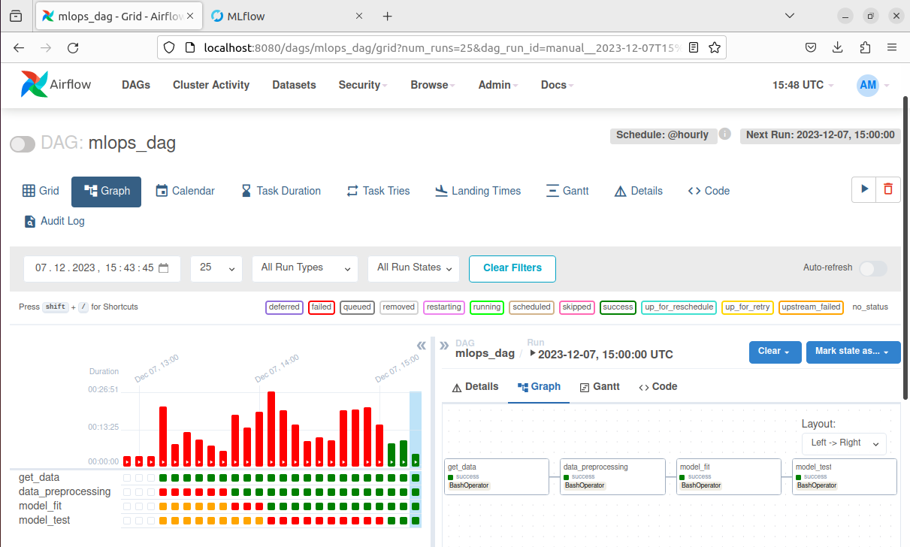
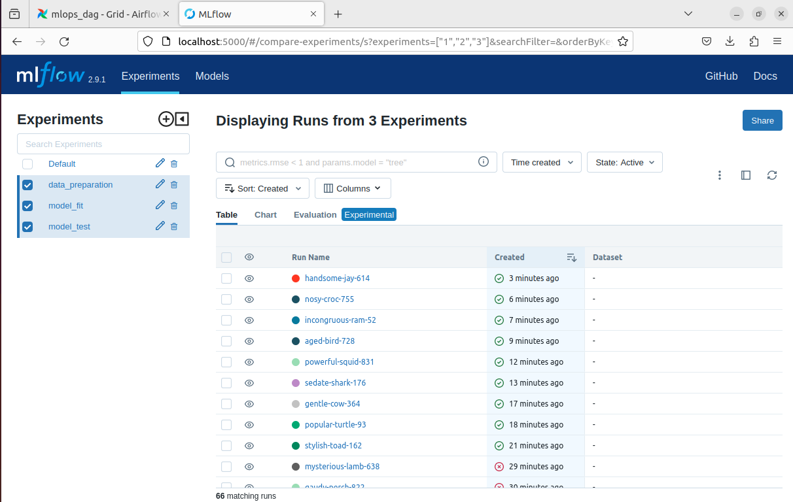

# MLops_Flow
Практическое задание №3 по дисциплине "Автоматизация машинного обучения"(MLops)
Для выполнения экспериментов над созданной моделью был выбран набор данных [MNIST](https://www.tensorflow.org/datasets/catalog/mnist)

## Реализация
* В ходе выполнения Практической работы №3 при помощи ПО VirtualBox была создана виртуальная машина ml_server (OS Ubuntu 22.04)
* Все необходимые библиотеки можно найти в `requirements.txt`
* Гиперпараметры модели можно изменять в файле `params.yaml`
* В папке dags директория airflow размещен DAG `mlops_dag.py` 

## Airflow
 

## MLFlow
 
